CUDA Stream Compaction
======================

**University of Pennsylvania, CIS 565: GPU Programming and Architecture, Project 2**

* Akshay Shah
* Tested on: Windows 10, i7-5700HQ @ 2.70GHz 16GB, GTX 970M 6GB (Personal Computer)

### GPU Path Tracer

CUDA Summary
------------

The below analysis and results have been performed on a scene with the cornell box that has all the material types and two light sources.

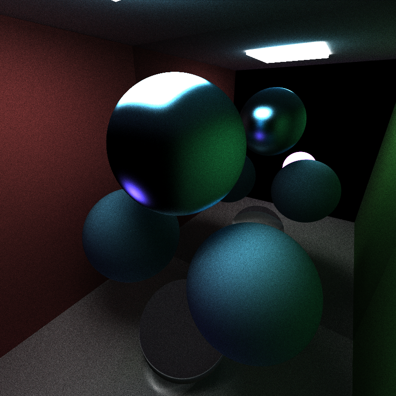

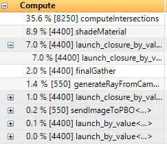

Most of the time was spent in the main path trace loop to check intersection after a ray was shot. `shadeMaterial` captures the next highest device time due to the computation of refraction and other complex materials types such as the Oren-Nayar microfacet and Blinn Microfacet Model. The `launch_closure_by_value` function is part of thrust's `remove_if` stream compaction. The amount of time that is spent in here(stream compaction) is well received in terms of total time saved.

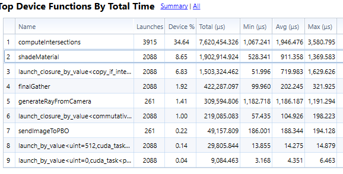

The above image indicates the total time spent in each device function with corresponding number of launches. To reduce the total time spent in `shadeMaterial`, separate BRDF function calls could be made to avoid branches inside `shadeMaterial` itself and let class definitions do their job.

Analysis
--------

The above image shows a comparison of time taken in the `computeIntersection` function with different techniques
- No caching first ray bounce
- Caching first ray bounce
- Sorting the rays and intersections by material type

The reason for a longer time for sorting could be that, there are not enough materials in the scene (and the scene is also not large enough. Maybe a scene as large as at least 1000 objects) that the rays show a significant change by sorting them by material.

The above image shows a comparison of time taken with and without stream compaction. There is a significant change when `thrust::remove_if` is used to weed out rays that have finished bouncing in the scene i.e., rays that have `remainingBounces` 0 will be removed from the pool of "threads".

Output
------

Anti-Aliasing
-------------
The following image shows an example of stochastic anti-aliasing that was used in the path tracer to clean out the jaggies.

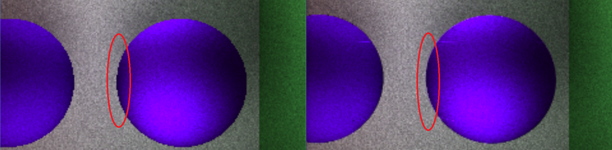

REFRACTION
----------

The refractive indices of the glass spheres are 1.5
Each of them has also been approximated for glass using Schlick's method.

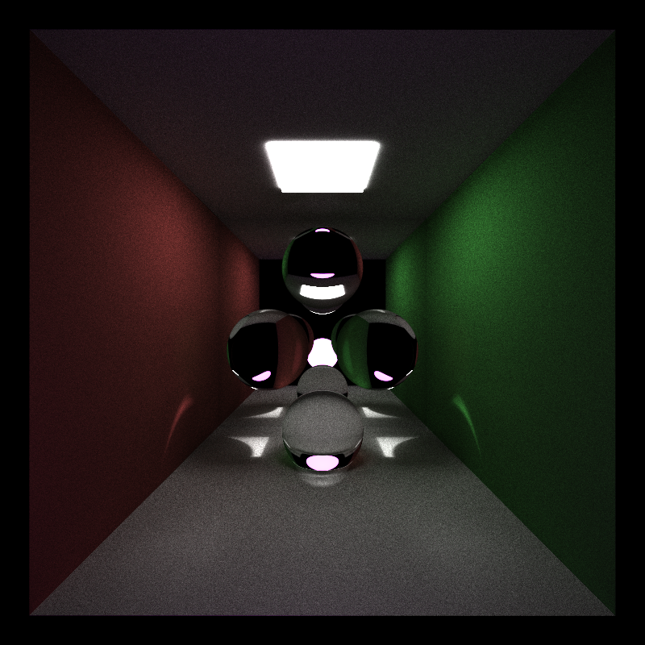

DOF (Depth of Field)
--------------------

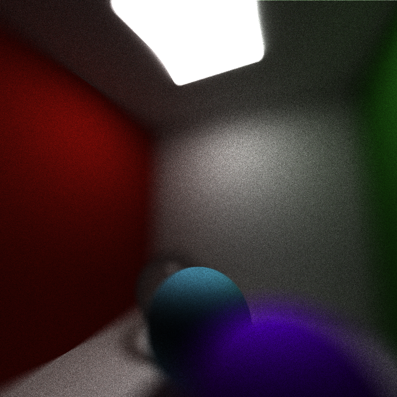

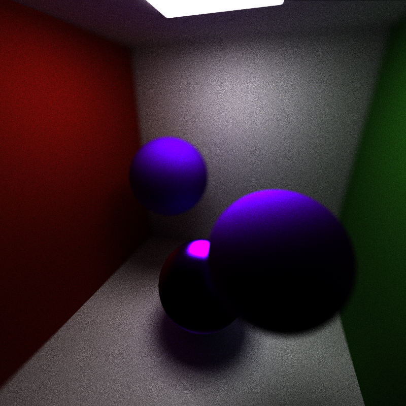

MATERIALS
---------
The following image shows a material comparison between two diffuse materials:
- Lambertian diffuse
- Oren-Nayar diffuse

The Oren-Nayar diffuse material in the render below has a roughness value of 20

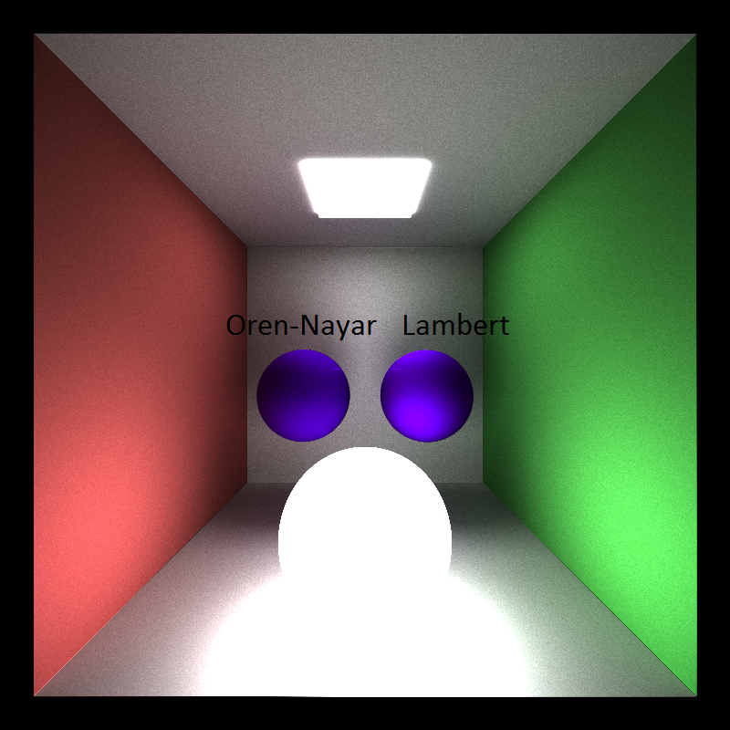

MIRROR
------

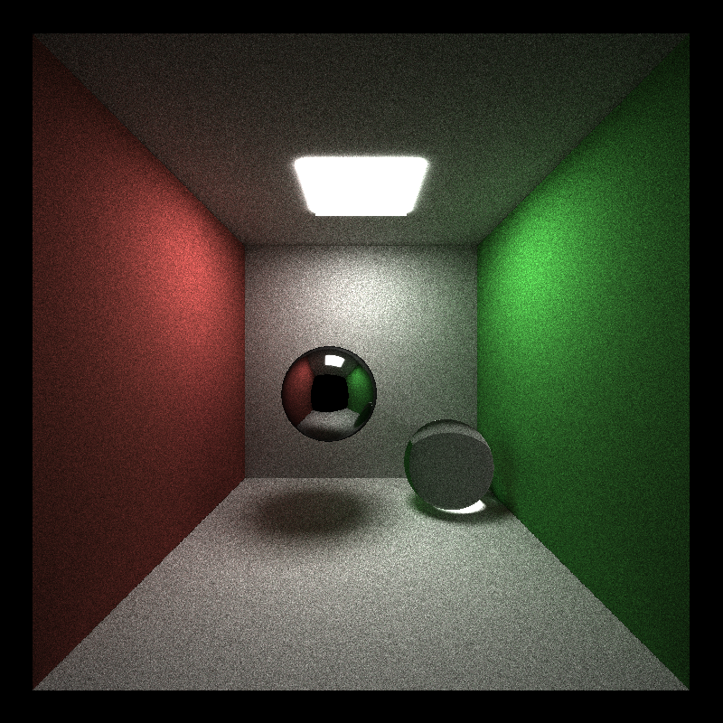

Blinn Microfacet
----------------

The following render displays the Blinn Microfacet model with an exponent of 10 in this particular example.
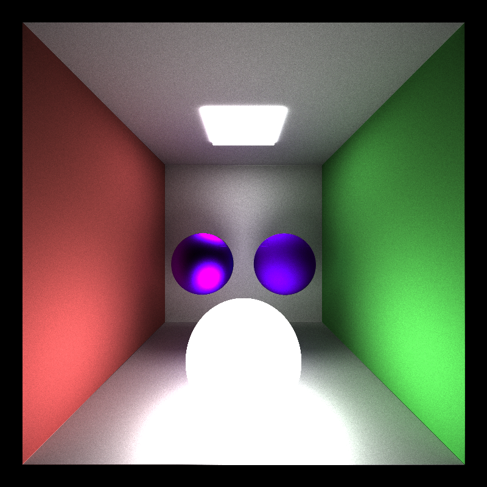

Just things
-----------
A render of UFO looking saucers with refractive properties. >.<

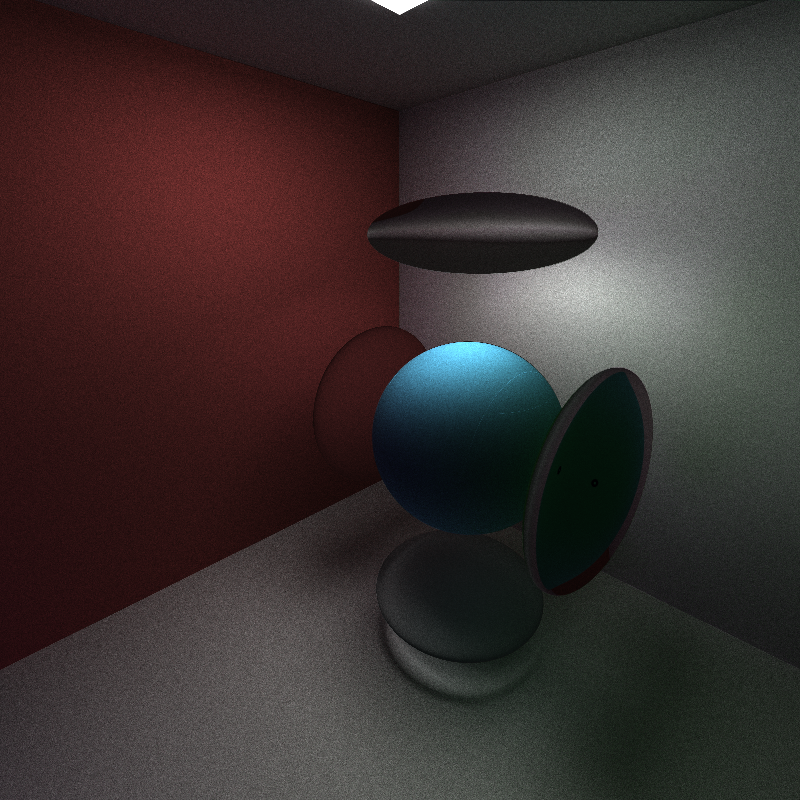

 
 
 

##### BLOOPERS

When trying to add Stratified sampling to sample diffuse hemispheres.

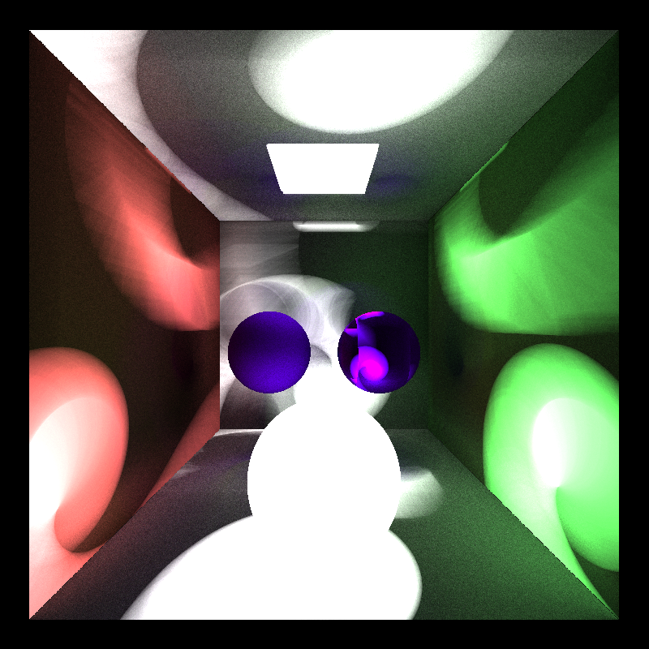

When trying to add Halton sequences to sample diffuse hemispheres.

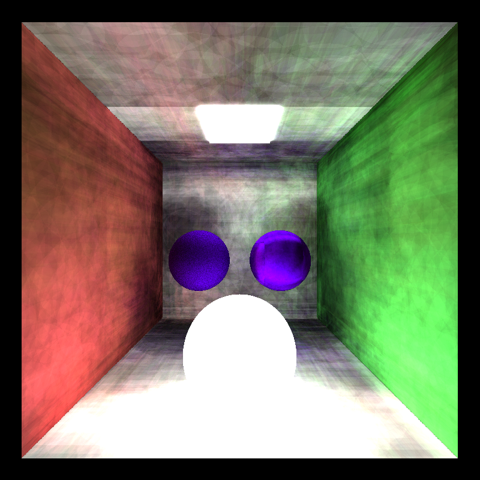

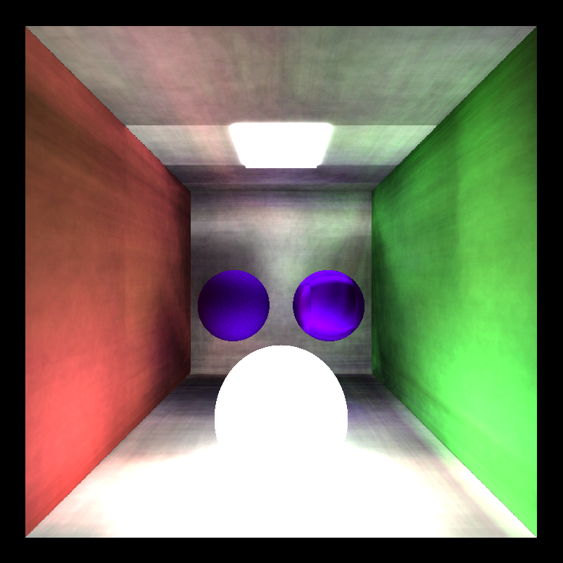

Trying to add refraction

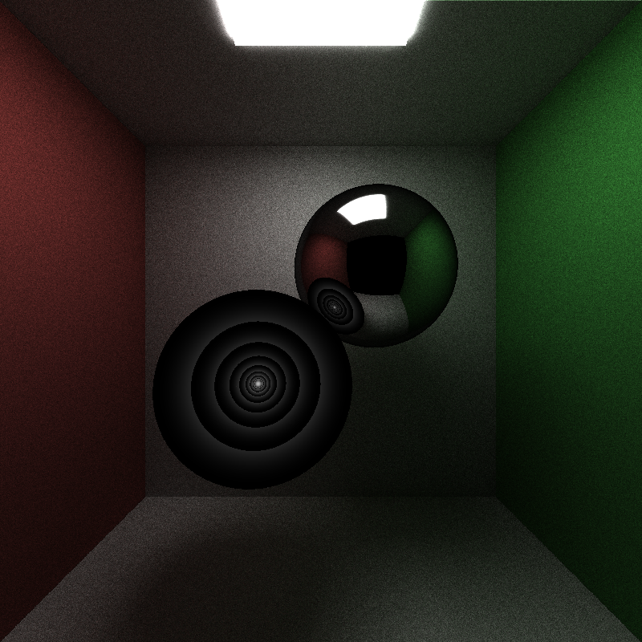
